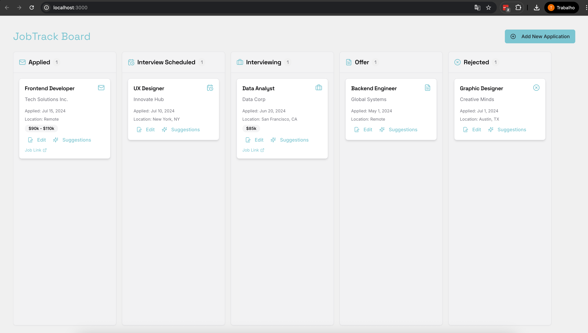
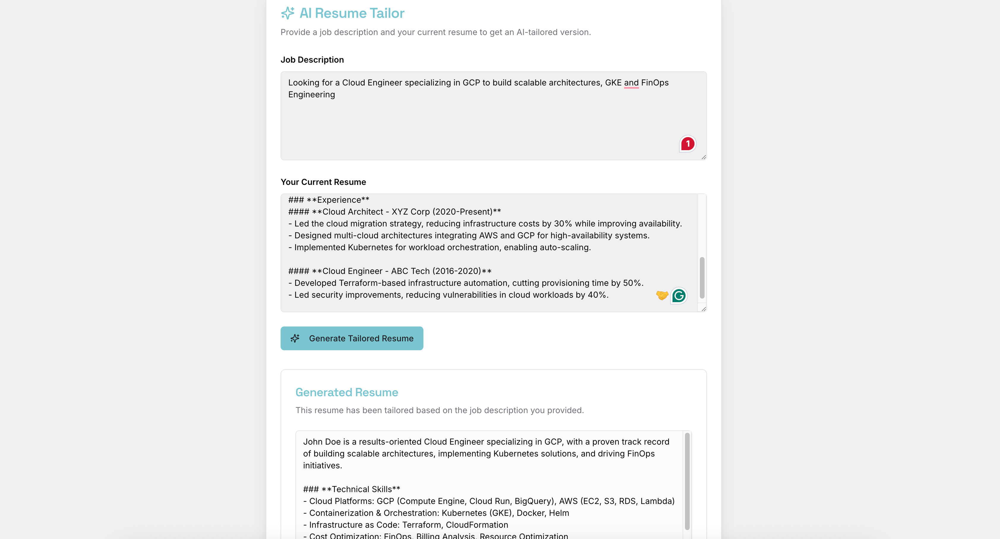

## 📌 Kanban-Board (New Version — Under Development)

A new version of the application is being developed inside the `kanban-board` folder.

This standalone app includes:

- 📝 **Resume Generation**: Parses your input and prepares ATS-friendly resumes (⚠️ export to `.docx` is not yet implemented).
- 🗂️ **Kanban Board**: Visual interface to track each job application across stages like _To Do_, _In Progress_, and _Done_.
- 🤖 **AI-Powered Actionables**: Smart suggestions to guide your next steps based on each application's status and content.

### 🖼️ Preview






### ⚙️ Built with GenAI Toolkit

This version is built using [Genkit](https://genkit.dev/), offering a modern developer experience for LLM workflows.

- ✅ **Currently works only with the Gemini API** — you must provide an API key via environment variables (`.env`).
- 🔜 **Ollama support is planned** by following the official [Genkit Ollama plugin documentation](https://genkit.dev/docs/plugins/ollama/).
- ⚠️ Prompts are currently embedded and not yet modularized for reuse or model switching.

### ⚠️ Current Limitations

- ❌ **No persistent state**: The app does not store data — everything resets on refresh or restart.
- ❌ **No `.docx` export**: Resume generation is functional but doesn't yet export downloadable files.
- ⚠️ **No user authentication or database**: All features are stateless and ephemeral.

### 🚀 How to Run

To run this version locally using Docker:

```bash
# Clone the repository if you haven't
git clone https://github.com/your-username/your-repo-name.git
cd your-repo-name

# Navigate to the kanban-board folder
cd kanban-board

# Build the Docker image
docker build -t kanban-next-app .
```

